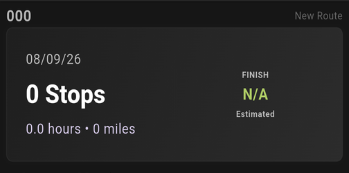
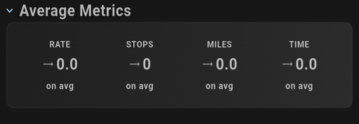
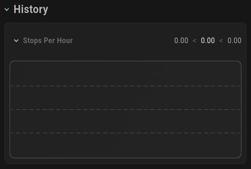
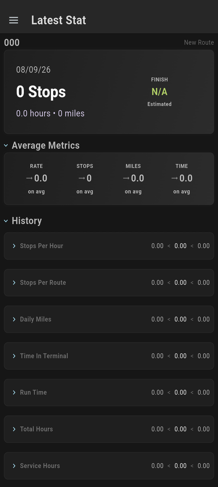
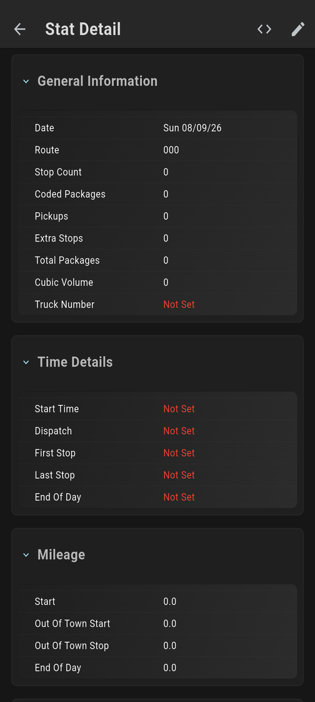
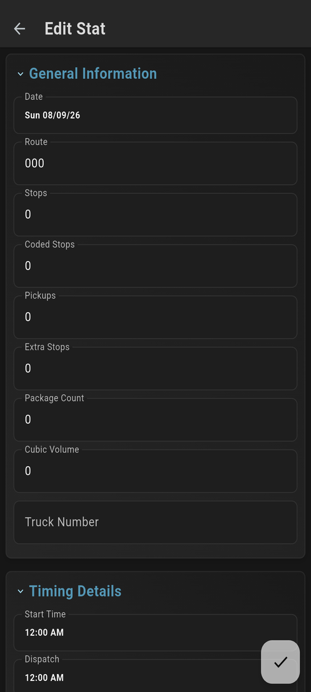
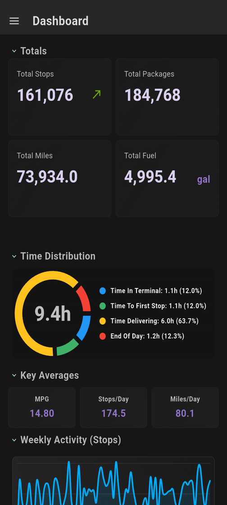
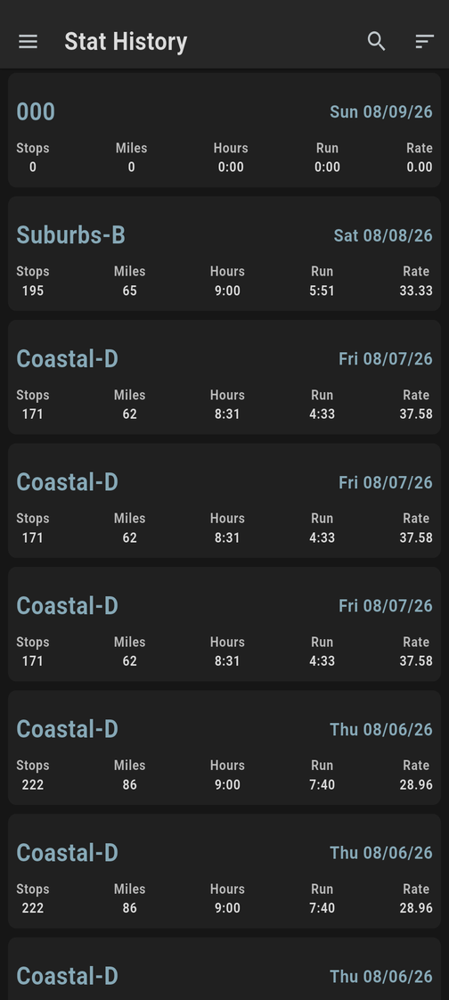
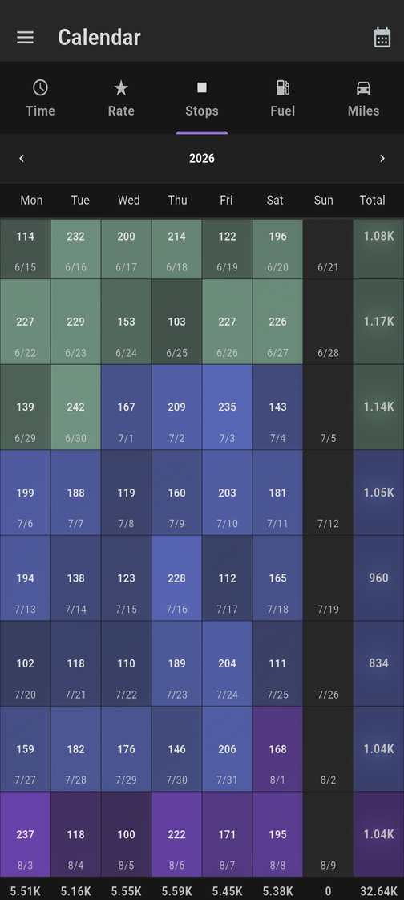

# Delivery Stats

Delivery Stats is a powerful performance tracking application designed to help
you monitor your routes, stop counts, delivery speed, and more. It provides a
suite of tools to visualize delivery data, track historical performance, and
gain perspective on your performance over time.

## Sidebar Menu

The application is organized into several modules accessible via the sidebar
menu. These modules are grouped into three main categories:

### Performance

Focuses on analyzing delivery speed, efficiency, and historical trends to help
you understand your performance over time.

* **Latest Stat**: A quick summary of the most recent activity for each route.
* **Dashboard**: A high-level overview of all-time totals and efficiency
  metrics.
* **Stat History**: A detailed list of all delivery runs.
* **Calendar**: A visual, date-based view of your performance metrics.

### Logistics

Tools for managing the core components of your delivery network.

* **Routes**: Management of the various delivery routes you service.
* **Trucks**: Management of the vehicle fleet used for deliveries.

### Tools

Administrative and organizational features to support your daily operations.

* **Notes**: A centralized location for managing delivery-related notes.
* **Attachments**: Management of files and photos associated with your routes
  and runs.
* **Import/Export**: Tools for data mobility, including backups and report
  generation.
* **Settings**: Configuration options for personalizing your application
  experience.

---

## Views

### Latest Stat

The **Latest Stat** view is your primary landing page for logging recent
activity. It features a swipeable pager that allows you to quickly cycle through
the latest data for each of your routes. It is sorted by the last route
operated.

|         | Component                     | Description                                                                                                                                                                                                                        |
|---------|-------------------------------|------------------------------------------------------------------------------------------------------------------------------------------------------------------------------------------------------------------------------------|
| Stops   |  | **Summary Card**: Displays the most recent run's key stats, including total stops, miles, and hours. **Stops label**: Tapping on the Stops label brings up the edit page for the stat. Here you can view the current data entered. |
| Metrics |  | **Average Metrics**: Compares your latest performance (Rate, Stops, Miles,Time) against your historical averages, highlighting whether you are performing above or below your typical levels.                                      |
| History |  | **History Charts**: Provides a visual trend of recent performance for a specific route, helping you identify patterns in performance.                                                                                              |

|                              |                              |                              |
|------------------------------|------------------------------|------------------------------|
|  |  |  |

### Dashboard

|                         |                                                                                                                                                                                        |
|-------------------------|----------------------------------------------------------------------------------------------------------------------------------------------------------------------------------------|
|  | The **Dashboard** provides a "big picture" view of your entire work history. It aggregates data from all runs to give you a comprehensive understanding of your personal productivity. |

* **All-Time Totals**: Summary of total stops made, total miles driven, and
  total time spent across all recorded data.
* **Time Distribution**: A pie chart showing how your day is typically divided
  between terminal time, driving to the first stop, delivering, and end-of-day
  activities.
* **Weekly Activity**: A bar chart visualizing your performance trends over the
  past week.
* **Efficiency Averages**: Key performance indicators (KPIs) like average stops
  per hour and average time per stop.

### Stat History

|                       |                                                                                                                                                                                                                                                                                                                           |
|-----------------------|---------------------------------------------------------------------------------------------------------------------------------------------------------------------------------------------------------------------------------------------------------------------------------------------------------------------------|
|  | The **Stat History** view provides a chronological list of every delivery run you have recorded. This is the place to go if you need to find specific details about a past delivery or review your progress over a long period. You can scroll through your entire history and tap on any entry to view its full details. |

### Calendar

|                        |                                                                                                                                                                                                                                                                                                                                                                                          |
|------------------------|------------------------------------------------------------------------------------------------------------------------------------------------------------------------------------------------------------------------------------------------------------------------------------------------------------------------------------------------------------------------------------------|
|  | The **Calendar** view offers a monthly or yearly visualization of your performance. It allows you to track specific metrics—such as the number of stops or your delivery rate—across time. By selecting different metrics, you can see how your performance fluctuates on different days of the week or throughout the month, making it easy to spot seasonal trends or weekly patterns. |

### Routes

In the **Routes** view, you can manage your delivery network. It displays a list
of all your defined routes, showing their names and descriptions. This view
serves as the entry point for managing route-specific data and viewing detailed
performance histories for individual routes.

### Trucks

The **Trucks** view allows you to manage your vehicle fleet. You can track
different trucks used in your operations, ensuring that delivery data is
correctly associated with the specific vehicle used for each run.

### Notes

The **Notes** view is a dedicated space for documenting important events,
route-specific information, or general reminders. It helps you keep track of
non-numerical data that is crucial for understanding the context of your
delivery performance.

### Attachments

The **Attachments** view provides a centralized interface for managing all
files, photos, or documents you have attached to your routes or runs. It makes
it easy to find and review visual evidence or supporting documentation for your
delivery activities.

### Import/Export

The **Import/Export** view is the hub for your data mobility needs. It allows
you to:

* **Export Data**: Create JSON backups of your entire database to ensure your
  information is safe.
* **Import Data**: Restore your data from a JSON backup, allowing you to move
  your session between devices or recover from a data loss.
* **Generate Reports**: (Future/Planned) Export your performance data into Excel
  or PDF formats for offline analysis or sharing with others.

### Settings

The **Settings** view allows you to customize the application to suit your
preferences. This includes managing how your data is displayed and configuring
application-wide behaviors.

---

## Logistics & Route Management

The application features a robust route management system that allows you to
organize your delivery network and track performance at a granular level.

### Route List

The **Routes** view acts as the central hub for your delivery network. It
provides a visual summary of your operations:

* **Total Runs Per Route**: A bar chart visualizing the volume of delivery runs
  completed for each route, allowing you to quickly identify your most active
  areas.
* **Route Cards**: Each route is represented by a card showing its name and the
  total number of runs recorded. Tapping a card opens the detailed view for that
  specific route.

### Route Details

The **Route Detail** view provides a deep dive into the performance and history
of a single route:

* **Performance Metrics**: Key stats specific to the route, helping you
  understand its efficiency.
* **Trucks Used**: A radial graph showing the distribution of runs across
  different vehicles in your fleet. It also displays the average number of stops
  per truck for that route.
* **Notes**: Route-specific documentation and instructions, supporting Markdown
  for rich text formatting.
* **History**: A full history of every run completed on this route.

---

## Data Mobility (IO)

The **Import/Export (IO)** module ensures that your data is portable, secure,
and accessible. It handles permissions, backups, and data restoration.

### Permissions

To function correctly, the application requires specific system permissions:

* **Storage**: Required for reading backup files during import and writing
  export files (JSON, etc.) to your device's storage.
* **Location**: Used for geotagging attachments (photos or files) with GPS
  coordinates, providing spatial context to your delivery data.

### Importing Data

You can restore your entire database or move your session to a new device using
the **Import** feature.

* **JSON Import**: Allows you to replace the internal database by selecting a
  previously exported JSON file. This is a complete "restore" operation that
  updates all your routes, runs, notes, and settings.

### Exporting & Reporting

The application provides several ways to move your data out of the app for
backups or analysis:

* **Data Backups (JSON)**: Export your entire database into a single JSON file.
  This is the primary method for creating secure backups that can be restored
  later.
* **Reporting (Excel/PDF)**: Generate professional reports in Excel (`.xlsx`) or
  PDF format. These reports are saved to your device's Downloads folder and are
  ideal for offline analysis, sharing with supervisors, or keeping permanent
  records of your delivery performance.

### Interaction Between Components

All components in the application are tightly integrated:

* **Routes & Stats**: Every delivery run (stat) is associated with a specific
  route and truck, allowing for the detailed aggregations seen in the Dashboard
  and Route Details.
* **Attachments & Notes**: You can attach photos or documents to specific routes
  or runs, and add notes to document unique events. These are all centrally
  manageable and are included in your data exports.
* **Logistics & Performance**: Changes made in the Logistics views (e.g.,
  updating a route description) are immediately reflected across all performance
  visualizations.
